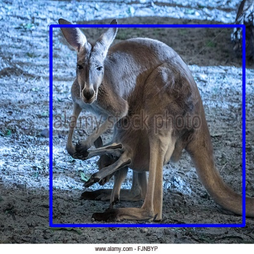

# YOLOv2: Inplement in Tensorflow 2



## Step-by-Step

```yolov2.ipynb```

1. Jupyter Notebook

    ```bash
    $ jupyter notebook
    ```

2. Colab

    [](https://colab.research.google.com/github.com/kaka-lin/yolov2-tf2/blob/master/yolov2.ipynb)

## Prepare the Dataset for training

1. Please download the [kangaroo](https://github.com/experiencor/kangaroo) dataset and put it into `data` folder. I already write a script for doing this, as flow:

    ```
    $ ./downloda_data.sh
    ```

2. parse voc and transfer to `tfrecord`.

    ```bash
    $ python3 voc_to_tfrecord.py
    ```

## Download pre-trained Darknet weights

```bash
$ wget https://pjreddie.com/media/files/yolov2.weights -O model_data/yolov2.weights
```

## Acknowledgments

- [YAD2K](https://github.com/allanzelener/YAD2K)
- [keras-yolo2](https://github.com/experiencor/keras-yolo2)
- [yolov3-tf2](https://github.com/zzh8829/yolov3-tf2)
